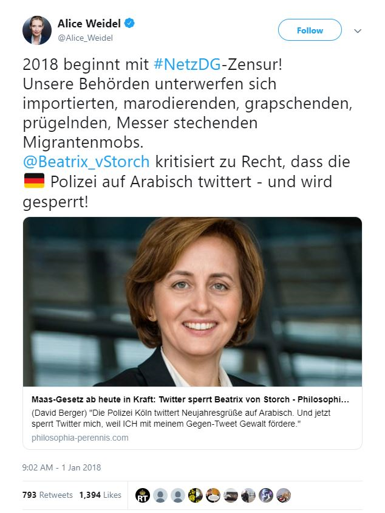
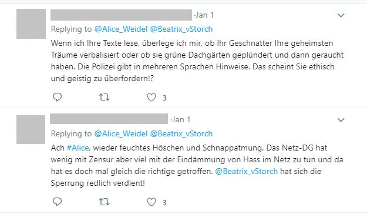
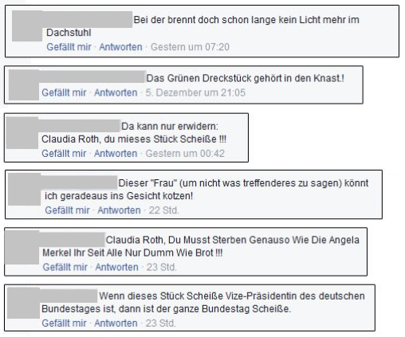

# Method-WIP
As laid out in chapter \@ref(predictors-for-counter-speech), there is some research on predictors for counter speech in general as well as a breadth of studies in the field of cyber-bystander research. To our knowledge, however, there have not been any studies on out-group favoring counter speech as of January 2020. Therefore, an exploratoy study design was chosen.
Data was gathered in two focus groups. Afterwards, the data was transcribed and analysed to find the most pertinent predictors. The full transcriptions as well as the full analysis can be found somewhere.

## Focus groups
We conducted two focus groups, asking participants about their experiences with online hate speech in general and their own reactions to hate speech in particular, i.e. if they engaged in in counter speech at all. Special emphasis was placed on counter speech on behalf of political adversaries, that is, people the participants considered to be their opponents in an online discussion.

### Guide and structure
The focus groups were conducted using a guide which was pre-tested once in advance. The sequence was structured into four sections, each concerned with one main topic:

1. Own experiences with hate speech.
2. Engagement in counter speech.
3. Conditions for counter speech for political adversaries.
4. Motivations for counter speech for political adversaries.

### Stimuli
At the beginning of each aforementioned section, one or more stimuli were shown. These stimuli were screenshots of pertinent online interactions, see e.g. \@ref(fig:stimulus-b). The research question aimed at counter speech on behalf of one's political adversary. At the same time, we did not differentiate between political affiliations but only between social media activity when sorting participants into groups. Therefore, finding universally fitting stimuli, i. e. one universally valid political adversary, proved challenging. Finally, we chose online interactions and tweets involving Alice Weidel, a member of the German right-wing party AfD, as well as posts aimed at one politician of the Greens, Claudia Roth. Not only can the Greens and the AfD be described as being representative of two endes of the political spectrum. [@leesAlternativeGermanyRise2018; @hambauerWerWaehltAfD2018; @maderEuropeanRefugeeCrisis2019] ALso, both the AfD and the Greens, especially Claudia Roth, could be considered highly polarizing in November and December of 2018 when the focus groups were conducted. [@gensingGruenenPolitikerinRothIm2018; @VolksverhetzungHunderteAnzeigen2018]

```{r stimulus-a, eval=FALSE, fig.align='center', fig.cap="Stimulus A (tweet by German politician Alice Weidel containing anti-immigrant rhetoric)", fig.show='hold', include=FALSE, out.width="50%"}

```


```{r stimulus-b, fig.cap="Stimulus B (insulting replies to one of German politician's Alice Weidel's tweets)",out.width="60%", fig.show='hold', fig.align='center'}

```

```{r stimulus-c, eval=FALSE, fig.align='center', fig.cap="Stimulus C (facebook comments insulting German politician Claudia Roth)", fig.show='hold', include=FALSE, out.width="60%"}

```

### Recording and transcription
Each focus group was recorded on audio. The recordings were then transcribed using MAXQDA. The transcription system employed was a modified version of GAT 2. [@seltingSystemTranscribingTalkininteraction2011] The full transcripts can be found somewhere.

## Participants
The participants were recruited through convenience. Based on preliminary questioning, the were sorted into two homogenous groups, the moderately active group and the very active group, in order to obtain more detailed results. [@schulzFokusgruppenEmpirischenSozialwissenschaft2012] Potential participants who reported only social media use or none at all were excluded. Participants who mostly consumed social media but only seldom posted or commented were sorted into the moderately active group (n=5), while participants who both used and commented and posted in social media became part of the very active group (n=6).
Before starting the focus group, each participant was surveyed on some demographic details as well as the frequency of their social media use, the frequency of them posting and commenting online, and their political left-right self-placement. [@breyerLeftRightSelfPlacementALLBUS] A sample of the questionnaire can be found somewhere. The results of that survey are displayed in Table \@ref(tab:table-participants). 
```{r read-participants, include=FALSE}
pf <- read.csv(file = "participants.csv",header = TRUE,sep = ";",quote = "",dec = ",", fill = TRUE, nrows = 11, )
```
```{r make-participants, include=FALSE}
group <- c('Moderately active group (n=5)', 'Very active group (n=6)')
genderfemale <- c(sum (pf[1:5,3]=='w'),sum (pf[6:11,3]=='w'))
gendermale <- c(sum(pf[1:5,3]=='m'),sum(pf[6:11,3]=='m'))
genderdis <- c(paste('Female: ',genderfemale[1], ', Male: ', gendermale[1], sep = ""), paste('Female: ',genderfemale[2], ', Male: ', gendermale[2], sep = ""))
agemean <- c(round(mean(pf[1:5,4]), digits=1), round(mean(pf[6:11,4]), digits = 1))
agesd <- c(round(sd(pf[1:5,4]), digits = 1), round(sd(pf[6:11,4]), digits = 1))
age <- c(paste('M=',agemean[1],', SD=',agesd[1], sep = ""), paste('M=',agemean[2],', SD=',agesd[2], sep = ""))
eduabi <- c(sum(pf[1:5,14]=='General Higher Education Entrance Qualification (Abitur)'), sum(pf[6:11,14]=='General Higher Education Entrance Qualification (Abitur)'))
eduuni <- c(sum(pf[1:5,14]=='University Degree'), sum(pf[6:11,14]=='University Degree'))
edu <- c(paste('General Higher Education Entrance Qualification (Abitur): ', eduabi[1], ', University Degree: ', eduuni[1], sep = ""), paste('General Higher Education Entrance Qualification (Abitur): ', eduabi[2], ', University Degree: ', eduuni[2], sep = ""))
occ <- c(paste('Student: ', sum(pf[1:5, 15]=='Student'), ', Full-Time Employment: ', (5 - sum(pf[1:5, 15]=='Student')), sep = ""), paste('Student: ', sum(pf[6:11, 15]=='Student'), ', Full-Time Employment: ', (6 - sum(pf[6:11, 15]=='Student')), sep = ""))
frqiumean <- c(round(mean(pf[1:5,11]), digits = 1), round(mean(pf[6:11,11]), digits = 1))
frqusd <- c(round(sd(pf[1:5,11]), digits = 1), round(sd(pf[6:11,11]), digits = 1))
frqiu <- c(paste('M=',frqiumean[1],', SD=',frqusd[1], sep = ""), paste('M=',frqiumean[2],', SD=',frqusd[2], sep = ""))
frqcpmean <- c(round(mean(pf[1:5,12]), digits=1), round(mean(pf[6:11,12]), digits=1))
frqcpsd <- c(round(sd(pf[1:5,12]), digits=1), round(sd(pf[6:11,12]), digits=1))
frqcp <- c(paste('M=',frqcpmean[1],', SD=',frqcpsd[1], sep = ""), paste('M=',frqcpmean[2],', SD=',frqcpsd[2], sep = ""))
lrspmean<- c(round(mean(pf[1:5,13]),digits = 1), round(mean(pf[6:11,13]), digits = 1))
lrspsd<- c(round(sd(pf[1:5,13]), digits = 1), round(sd(pf[6:11,13]), digits = 1))
lrsp <- c(paste('M=',lrspmean[1],', SD=',lrspsd[1], sep = ""), paste('M=',lrspmean[2],', SD=',lrspsd[2], sep = ""))
rwnm <- c('Group', 'Gender', 'Highest Level of Education', 'Student', 'Frequency of Use Social Media', 'Frequency of Posting and Commenting Online', 'Left-Right Self-Placement')
participants <- data.frame(group, genderdis, age, edu, occ, frqiu, frqcp, lrsp)
names (participants) <- c("Group", "Gender", "Age", "Highest Level\ of Education", "Occupation", "Frequency of Social Media Use","Frequency of Posting and Commenting Online", "Political Left-Right Self-Placement")
# names (participants)[6] <- paste0(names(participants)[6], footnote_marker_alphabet(1), footnote_marker_alphabet(2))
# names (participants)[7] <- paste0(names(participants)[7], footnote_marker_alphabet(1))
# names (participants)[8] <- paste0(names(participants)[8], footnote_marker_alphabet(3))
# There is a conflict when wanting to not escape the subscripts but wanting to escape the = in the description. Therefore commented out until I find a solution.
participants[1]<- NULL
parttrans <- as.data.frame(t(as.matrix(participants)))
names (parttrans) <- c("Moderately active group (n=5)", "Very active group (n=6)")
# Unsure how to escape special characters like =. Both \= as well as \\= do not seem to work.
```

```{r table-participants}
# Note that the label has to be added manually in the caption here.
parttrans %>% knitr::kable(caption = "Focus group participants", booktabs=T) 
# %>% kable_styling(full_width = F) %>% footnote(alphabet = c("1=never, 2=very rarely, 3=several times a month, 4=several times a week, 5=daily, 6=several times a day;", "Averaged over 6 types of platforms (social networking sites, video platforms, blogs, online newspapers, infotainment, social news);","1=left, 10=right")) %>% column_spec(1, width=20) %>% column_spec(2, width=40) %>% column_spec(3, width = 40)
# Tried to further format the table with extraKable and more packages in lncs-template-test. Unfortunately does not seem to work, therefore commented out. :)
```
The participants from the very active group score somewhat higher on average social media use frequency and much higher on the posting and commenting frequency. On average, they post or comment between once and several times a day. Therefore, the classification based on the preliminary questioning was proven valid. On average, participants from both groups were young, highly educated and politically left-leaning. In both groups, there were about as many men as women.

## Content analysis
We conducted a qualitative content analysis as described by @mayringQualitativeContentAnalysis2014 using MAXQDA. Spefically, we employed the summarizing technique. The categories were formed by combining a deductive with an inductive approach. Deductively, we followed the categorization into the very active and moderately active group as well as the categorization prescribed by our guide:

* _Moderately active group_
  + _Description_ (1. Own experiences with hate speech. and 2. Engagement in counter speech)
  + _Conditions_ (3. Conditions for counter speech for political adversaries.)
  + _Motivations_ (4. Motivations for counter speech for political adversaries.)
* _Very active group_
  + _..._
 
Inside these categories, more sub-categories were formed inductively.

### Intercoder reliability
After we first developed a categorization, we tested for intercoder reliability by calculating coefficient kappa using the approach of @brennan1981coefficient. The minimum coding overlap was 60%. The results are shown in table \@ref(tab:table-intercoder-reliability).

```{r table-intercoder-reliability}
tribble(
  ~`Category`, ~`Number of codes`, ~`Minimum coding overlap`, ~`Agreement`, ~`kappa`,
  "Moderately active group",  82, "60%", "27.16%", 0.26,
  "Very active group",  124, "60%","27.23%", 0.26
) %>% knitr::kable(caption = "Intercoder Reliability", booktabs=T, longtable=T)
```
Overall, a kappa of 0.26 was calculated. This proposes unssatisfactory reliability which is, however, not out of the ordinary for the first iteration of intercoder reliability examination. [@campbellCodingIndepthSemistructured2013; @macphailProcessGuidelinesEstablishing2016] To remedy this lack of reliability, we employed the Intercoder Agreement method as described by @campbellCodingIndepthSemistructured2013.

In figure xy, (DO MOAR: make and include figure) an overview of the final categorization is visible. The full categorization can be found somewhere.
